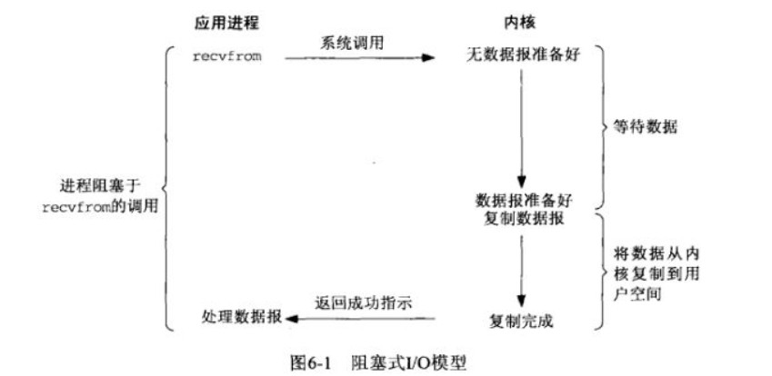
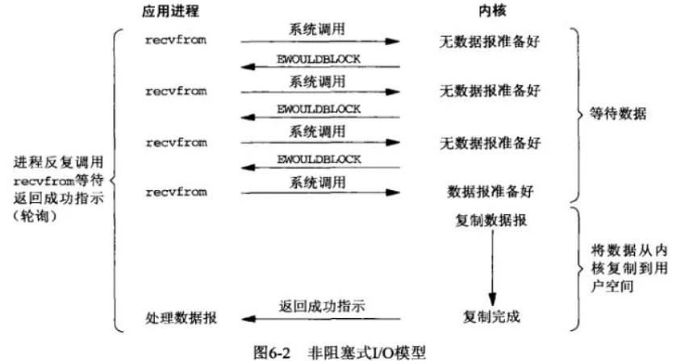
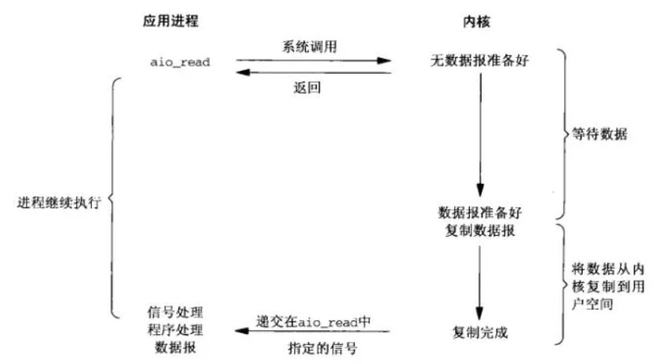
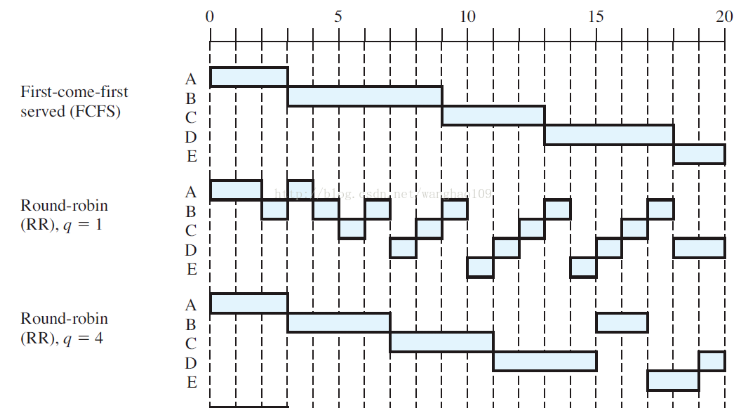
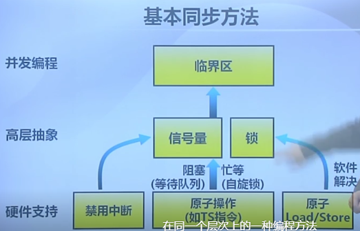
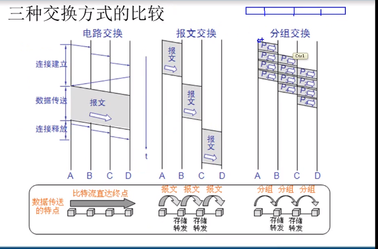
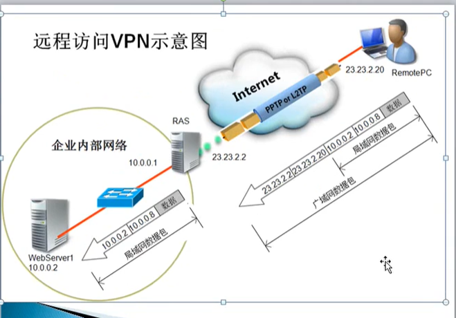
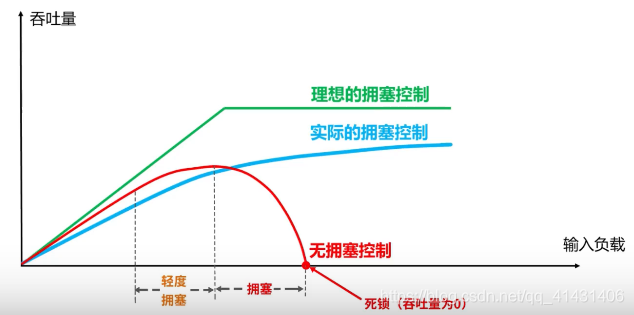
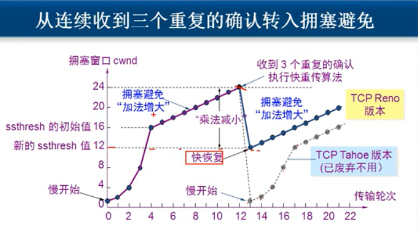
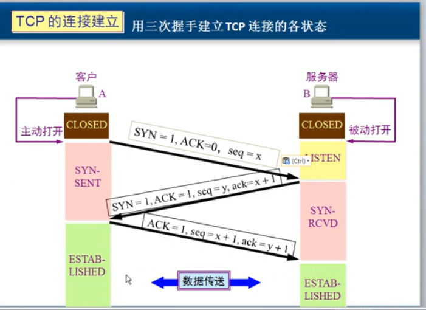

# 软件开发基础-Java IO模型、os、计网

基于校招大厂Java开发的秋招笔记，对后台工程师秋招所需的基础知识（Java IO、os、计算机网络）进行了梳理，参考链接均以ref的形式标出 需要注意的是，本笔记**适用于复习&&巩固高频知识点，可能不适用于入门学习** 问题||建议||内推，欢迎Issues交流

based on [jeannia](https://blog.csdn.net/weixin_43795472?spm=1001.2014.3001.5509)'s note

written by [Zayn Xu](https://github.com/ZaynXu/BE-note)

## java I/O模型

**所有的系统I/O都分为两个阶段：等待就绪和操作。举例来说，读函数，分为等待系统可读和真正的读；同理，写函数分为等待网卡可以写和真正的写。**

需要说明的是等待就绪的阻塞是不使用CPU的，是在“空等”；而真正的读写操作的阻塞是使用CPU的，真正在“干活”，而且这个过程非常快，属于memory copy，带宽通常在1GB/s级别以上，可以理解为基本不耗时。

### Linux中的IO模型 [ref](https://mp.weixin.qq.com/s?__biz=Mzg3MjA4MTExMw==&mid=2247484746&idx=1&sn=c0a7f9129d780786cabfcac0a8aa6bb7&source=41&scene=21#wechat_redirect)

- 在Linux(UNIX)操作系统中，共有五种IO模型，分别是：**阻塞IO模型**、**非阻塞IO模型**、**IO复用模型**、**信号驱动IO模型**以及**异步IO模型**。
- 阻塞IO模型
    - 一般表现为进程或线程等待某个条件，如果条件不满足，则一直等下去。条件满足，则进行下一步操作。
    - 应用进程通过系统调用 `recvfrom` 接收数据，但由于内核还未准备好数据报，应用进程就会阻塞住，直到内核准备好数据报，`recvfrom` 完成数据报复制工作，应用进程才能结束阻塞状态。

        

    - 优点：实现简单，缺点：并发低，实时性要求低
- 非阻塞IO模型
    - 应用进程与内核交互，目的未达到之前，不再一味的等着，而是直接返回。然后通过轮询的方式，不停的去问内核数据准备有没有准备好。如果某一次轮询发现数据已经准备好了，那就把数据拷贝到用户空间中。

        

    - 应用进程通过 `recvfrom` 调用不停的去和内核交互，直到内核准备好数据。如果没有准备好，内核会返回`error`，应用进程在得到`error`后，过一段时间再发送`recvfrom`请求。在两次发送请求的时间段，进程可以先做别的事情。
    - 这种方式和阻塞IO比，所使用的工具没有什么变化，但是等待数据的时候可以做些其他事情，增加时间的利用率。
- 信号驱动IO模型
    - 应用进程预先向内核注册一个信号处理函数，然后用户进程返回，并且**不阻塞**，当内核数据准备就绪时会发送一个信号给进程，用户进程便在信号处理函数中开始把数据拷贝到用户空间中。

        

    - 实现复杂，cpu利用率高
- IO复用模型
    - 多个进程的IO可以注册到同一个管道上，这个管道会统一和内核进行交互。当管道中的某一个请求需要的数据准备好之后，进程再把对应的数据拷贝到用户空间中。
    - IO多路转接是多了一个`select`函数，多个进程的IO可以注册到同一个`select`上，当用户进程调用该`select`，`select`会监听所有注册好的IO，如果所有被监听的IO需要的数据都没有准备好时，`select`调用进程会阻塞。当任意一个IO所需的数据准备好之后，`select`调用就会返回，然后进程在通过`recvfrom`来进行数据拷贝。

        

    - **这里的IO复用模型，并没有向内核注册信号处理函数，所以，他并不是非阻塞的。**进程在发出`select`后，要等到`select`监听的所有IO操作中至少有一个需要的数据准备好，才会有返回，并且也需要再次发送请求去进行文件的拷贝。
- 以上四种模型都是同步的
    - 阻塞IO模型、非阻塞IO模型、IO复用模型和信号驱动IO模型**的数据拷贝过程都是同步的**
    - **信号驱动难道不是异步的么？** 信号驱动，内核是在数据准备好之后通知进程，然后进程再通过`recvfrom`操作进行数据拷贝。我们可以认为 **数据准备阶段是异步的**，但是，数据拷贝操作是同步的。所以， **整个IO过程也不能认为是异步的**。
- **异步IO模型**：整个IO过程异步
  
- 应用进程把IO请求传给内核后，完全由内核去操作文件拷贝。内核完成相关操作后，会发信号告诉应用进程本次IO已经完成。
  
    
    
    - 用户进程发起`aio_read`操作之后，给内核传递描述符、缓冲区指针、缓冲区大小等，告诉内核当整个操作完成时，如何通知进程，然后就立刻去做其他事情了。当内核收到`aio_read`后，会立刻返回，然后内核开始等待数据准备，数据准备好以后，直接把数据拷贝到用户控件，然后再通知进程本次IO已经完成。
- 5种IO模型对比

    

### Linux IO复用模型详解 [ref](https://mp.weixin.qq.com/s/3gC-nUnFGv-eoSBsEdSZuA)

- 一切的开始，都起源于这个 read 函数是操作系统提供的，而且是阻塞的，我们叫它 **阻塞 IO**。为了破这个局，程序员在用户态通过多线程来防止主线程卡死。

    后来操作系统发现这个需求比较大，于是在操作系统层面提供了非阻塞的 read 函数，这样程序员就可以在一个线程内完成多个文件描述符的读取，这就是 **非阻塞 IO**。

    但多个文件描述符的读取就需要遍历，当高并发场景越来越多时，用户态遍历的文件描述符也越来越多，相当于在 while 循环里进行了越来越多的系统调用。后来操作系统又发现这个场景需求量较大，于是又在操作系统层面提供了这样的遍历文件描述符的机制，这就是 **IO 多路复用**。

- IO 模型的演进，其实就是时代的变化，倒逼着操作系统将更多的功能加到自己的内核而已。多路复用快的原因在于，操作系统提供了这样的系统调用，使得原来的 while 循环里多次系统调用，变成了一次系统调用 + 内核层遍历这些文件描述符.
- 模型思想: 每 accept 一个客户端连接后，将这个文件描述符（connfd）放到一个数组里。然后os通过轮询/异步的方法获取到
- **select**
  
- select 是操作系统提供的系统调用函数，通过它，我们可以把一个文件描述符的数组发给操作系统， 让操作系统去遍历，确定哪个文件描述符可以读写， 然后告诉我们去处理：
  
    
    
- 服务器代码
  
    ```java
//首先一个线程不断接受客户端连接，并把 socket 文件描述符放到一个 list 里。
    
    while(1) {
      connfd = accept(listenfd);
      fcntl(connfd, F_SETFL, O_NONBLOCK);
      fdlist.add(connfd);
    }
//然后，另一个线程不再自己遍历，而是调用 select，将这批文件描述符 list 交给操作系统去遍历。
    
    while(1) {
      // 把一堆文件描述符 list 传给 select 函数
      // 有已就绪的文件描述符就返回，nready 表示有多少个就绪的
      nready = select(list);
      ...
    }
//不过，当 select 函数返回后，用户依然需要遍历刚刚提交给操作系统的 list。
    
    ```

//只不过，操作系统会将准备就绪的文件描述符做上标识，用户层将不会再有无意义的系统调用开销。
    
```java
while(1) {
  nready = select(list);
  // 用户层依然要遍历，只不过少了很多无效的系统调用
  for(fd <-- fdlist) {
    if(fd != -1) {
      // 只读已就绪的文件描述符
      read(fd, buf);
      // 总共只有 nready 个已就绪描述符，不用过多遍历
      if(--nready == 0) break;
    }
  }
}
//正如刚刚的动图中所描述的，其直观效果如下。（同一个动图消耗了你两次流量，气不气？）
```


可以看出几个细节：
    
1. select 调用需要传入 fd 数组，需要拷贝一份到内核，高并发场景下这样的拷贝消耗的资源是惊人的。（可优化为不复制）
   
2. select 在内核层仍然是通过遍历的方式检查文件描述符的就绪状态，是个同步过程，只不过无系统调用切换上下文的开销。（内核层可优化为异步事件通知）
   
3. **select 仅仅返回可读文件描述符的个数，具体哪个可读还是要用户自己遍历。**（可优化为只返回给用户就绪的文件描述符，无需用户做无效的遍历）
   


    
    - 这种方式，既做到了一个线程处理多个客户端连接（文件描述符），又减少了系统调用的开销（多个文件描述符只有一次 select 的系统调用 + n 次就绪状态的文件描述符的 read 系统调用）。
- poll
  
    - poll 也是操作系统提供的系统调用函数。它和 select 的主要区别就是，去掉了 select 只能监听 1024 个文件描述符的限制。
- epoll
    - epoll 主要针对这三点进行了改进。
    1. 内核中保存一份文件描述符集合，无需用户每次都重新传入，只需告诉内核修改的部分即可。
    2. 内核不再通过轮询的方式找到就绪的文件描述符，而是通过异步 IO 事件唤醒。
    3. 内核仅会将有 IO 事件的文件描述符返回给用户，用户也无需遍历整个文件描述符集合。

### IO流

- 什么是流：流是个抽象的概念,是对输入输出设备的抽象，输入流可以看作一个输入通道，输出流可以看作一个输出通道，输入输出是相对于程序而言的。
- 字符流与字节流：
    - 字节流：
        - 传输过程中，传输数据的最基本单位是字节的流
    - 字符流：
        - 传输过程中，传输数据的最基本单位是字符的流
        - 先读取硬盘上的字节，然后使用编码表封装成字符，本质还是对字节进行操作
- 四大基类：InputStream, OutputStream, Reader, Writer
- FileReader：读取的文件一定要存在
- Writer：
    - FIleWriter：写入的文件不一定存在，可临时创建，调用write()直接IO
    - BufferedWriter：调用write()时使用缓冲区存储，缓冲区满了再IO
- InputStream：System.in就是字节流
    - FileInputStream：直接将字节写入文件中
    - FileOutputStream：一次读一个字节，因此不能读中文

### BIO、AIO、NIO [ref1](https://blog.csdn.net/m0_38109046/article/details/89449305) [ref2](https://zhuanlan.zhihu.com/p/23488863)

- 传统的BIO里面socket.read()，如果TCP RecvBuffer里没有数据，函数会一直阻塞，直到收到数据，返回读到的数据。
- 对于NIO，如果TCP RecvBuffer有数据，就把数据从网卡读到内存，并且返回给用户；反之则直接返回0，永远不会阻塞。
- 最新的AIO(Async I/O)里面会更进一步：不但等待就绪是非阻塞的，就连数据从网卡到内存的过程也是异步的。
- 换句话说，BIO里用户最关心“我要读”，NIO里用户最关心“我可以读了”，在AIO模型里用户更需要关注的是“读完了”。
- NIO一个重要的特点是：socket主要的读、写、注册和接收函数，在等待就绪阶段都是非阻塞的，真正的I/O操作是同步阻塞的（消耗CPU但性能非常高）。
- BIO、AIO、NIO是java对os中各种io模型的封装，比如在**Linux 2.6以后，Java中NIO和AIO都是通过epoll来实现的，而在Windows上，AIO是通过IOCP来实现的。**
- BIO （blocking I/O）
    - 1请求1应答，服务器在while(true) 中监听客户端的通信请求，每一次通信都在一个单独的线程里，可用线程池构造伪异步IO，通信基于InputStream/OutputStream，流中的read()、write()和accept()是阻塞的
    - 特点
        - 现在的多线程一般都使用线程池，可以让线程的创建和回收成本相对较低。在活动连接数不是特别高（小于单机1000）的情况下，这种模型是比较不错的，可以让每一个连接专注于自己的I/O并且编程模型简单，也不用过多考虑系统的过载、限流等问题。
    - 缺点
        - 线程自身占用较多内存
        - 线程切换成本较高
        - 创建销毁线程代价昂贵（可使用线程池维护）
        - 会造成锯齿状系统负载（可能大量请求的结果同时返回）
    - 伪异步IO
        - 当有新的客户端接入时，将客户端的 Socket 封装成一个Task（该任务实现java.lang.Runnable接口）投递到后端的线程池中进行处理，JDK 的线程池维护一个消息队列和 N 个活跃线程，对消息队列中的任务进行处理。由于线程池可以设置消息队列的大小和最大线程数，因此，它的资源占用是可控的，无论多少个客户端并发访问，都不会导致资源的耗尽和宕机。
        - 伪异步I/O通信框架采用了线程池实现，因此避免了为每个请求都创建一个独立线程造成的线程资源耗尽问题。
- NIO （new I/O||non-blocking I/O）
    - NIO提供了与传统BIO模型中的 `Socket` 和 `ServerSocket` 相对应的 `SocketChannel` 和 `ServerSocketChannel` 两种不同的套接字通道实现，两种通道都支持阻塞和非阻塞两种模式。
    - NIO的主要事件有几个：读就绪、写就绪、有新连接到来。
        1. 我们首先需要注册当这几个事件到来的时候所对应的处理器。然后在合适的时机告诉事件选择器：我对这个事件感兴趣。对于写操作，就是写不出去的时候（socket.write()返回0）对写事件感兴趣；对于读操作，就是完成连接和系统没有办法承载新读入（socket.read()返回0）的数据的时；对于accept，一般是服务器刚启动的时候；而对于connect，一般是connect失败需要重连或者直接异步调用connect的时候
        2. 其次，用一个死循环选择就绪的事件，会执行系统调用（Linux 2.6之前是select、poll，2.6之后是epoll，Windows是IOCP），还会阻塞的等待新事件的到来。新事件到来的时候，会在selector上注册标记位，标示可读、可写或者有连接到来，然后selector切换到其它就绪的连接（channel）继续进行读写。
        3. 注意，Selector.select()是阻塞的，无论是通过操作系统的通知（epoll）还是不停的轮询(select，poll)，这个函数是阻塞的。所以你可以放心大胆地在一个while(true)里面调用这个函数而不用担心CPU空转。
        4. 最简单的Reactor模式：注册所有感兴趣的事件处理器，单线程轮询选择就绪事件，执行事件处理器。
    - NIO 读数据和写数据方式
        - 通常来说NIO中的所有IO都是从 Channel（通道） 开始的。
        - 从通道进行数据读取 ：创建一个缓冲区，然后请求通道读取数据。
        - 从通道进行数据写入 ：创建一个缓冲区，填充数据，并要求通道写入数据。
        - NIO由原来的阻塞读写（占用线程）变成了单线程轮询事件，找到可以进行读写的网络描述符进行读写。除了 **事件的轮询是阻塞的（没有可干的事情必须要阻塞）**，剩余的I/O操作都是纯CPU操作，没有必要开启多线程。
    - 核心API：chanel、buffer、selector
- Java的Selector对于Linux系统来说，有一个致命限制：同一个channel的select不能被并发的调用。因此，如果有多个I/O线程，必须保证：一个socket只能属于一个IOThread，而一个IOThread可以管理多个socket。
- **Proactor与Reactor**
    - I/O 复用机制需要事件分发器（event dispatcher），开发人员在开始的时候需要在分发器那里注册感兴趣的事件，并提供相应的处理者（event handler)，或者是回调函数；事件分发器在适当的时候，会将请求的事件分发给这些handler或者回调函数。涉及到事件分发器的两种模式称为：Reactor和Proactor。
    - Reactor模式
        - Reactor模式是基于同步I/O的，而Proactor模式是和异步I/O相关的。在Reactor模式中，事件分发器等待某个事件或者可应用或个操作的状态发生（比如文件描述符可读写，或者是socket可读写）， **事件分发器就把这个事件传给事先注册的事件处理函数或者回调函数，由后者来做实际的读写操作。**
        - 在Reactor中实现读
            1. 注册读就绪事件和相应的事件处理器。
            2. 事件分发器等待事件。
            3. 事件到来，激活分发器，分发器调用事件对应的处理器。
            4. 事件处理器完成实际的读操作，处理读到的数据，注册新的事件，然后返还控制权。

```java
//伪代码
interface ChannelHandler{
    void channelReadable(Channel channel);
    void channelWritable(Channel channel);
}
class Channel{
    Socket socket;
    Event event;//读，写或者连接
}

//IO线程主循环:
class IoThread extends Thread{
    public void run(){
        Channel channel;
        while(channel=Selector.select()){//选择就绪的事件和对应的连接
            if(channel.event==accept){
                registerNewChannelHandler(channel);//如果是新连接，则注册一个新的读写处理器
            }
            if(channel.event==write){
                getChannelHandler(channel).channelWritable(channel);//如果可以写，则执行写事件
            }
            if(channel.event==read){
                getChannelHandler(channel).channelReadable(channel);//如果可以读，则执行读事件
            }
        }
    }
    Map<Channel，ChannelHandler> handlerMap;//所有channel的对应事件处理器
}
```

- Proactor模式
    - Proactor模式中，事件处理者（或者代由事件分发器发起）直接发起一个异步读写操作（相当于请求），而实际的工作是由操作系统来完成的。发起时，需要提供的参数包括用于存放读到数据的缓存区、读的数据大小或用于存放外发数据的缓存区，以及这个请求完后的回调函数等信息。事件分发器得知了这个请求，它默默等待这个请求的完成，然后转发完成事件给相应的事件处理者或者回调。举例来说，在Windows上事件处理者投递了一个异步IO操作（称为overlapped技术），事件分发器等IO Complete事件完成。这种异步模式的典型实现是基于操作系统底层异步API的，所以我们可称之为“系统级别”的或者“真正意义上”的异步，因为 **具体的读写是由操作系统异步实现的的。**
    - 在Proactor中实现读：
        1. 处理器发起异步读操作（注意：操作系统必须支持异步IO）。在这种情况下，处理器无视IO就绪事件，它关注的是完成事件。
        2. 事件分发器等待操作完成事件。
        3. 在分发器等待过程中，操作系统利用并行的内核线程执行实际的读操作，并将结果数据存入用户自定义缓冲区，最后通知事件分发器读操作完成。
        4. 事件分发器呼唤处理器。
        5. 事件处理器处理用户自定义缓冲区中的数据，然后启动一个新的异步操作，并将控制权返回事件分发器。

    ```java
    interface ChannelHandler{
          void channelReadComplate(Channel channel，byte[] data);
          void channelWritable(Channel channel);
       }
       class Channel{
         Socket socket;
         Event event;//读，写或者连接
       }

       //IO线程主循环：
       class IoThread extends Thread{
       public void run(){
       Channel channel;
       while(channel=Selector.select()){//选择就绪的事件和对应的连接
          if(channel.event==accept){
             registerNewChannelHandler(channel);//如果是新连接，则注册一个新的读写处理器
             Selector.interested(read);
          }
          if(channel.event==write){
             getChannelHandler(channel).channelWritable(channel);//如果可以写，则执行写事件
          }
          if(channel.event==read){
              byte[] data = channel.read();
              if(channel.read()==0)//没有读到数据，表示本次数据读完了
              {
              getChannelHandler(channel).channelReadComplate(channel，data;//处理读完成事件
              }
              if(过载保护){
              Selector.interested(read);
              }

          }
         }
        }
       Map<Channel，ChannelHandler> handlerMap;//所有channel的对应事件处理器
       }
    ```

- Selector.wakeup()
    - 主要作用
    - 解除阻塞在Selector.select()/select(long)上的线程，立即返回。
    - 两次成功的select之间多次调用wakeup等价于一次调用。
    - 如果当前没有阻塞在select上，则本次wakeup调用将作用于下一次select——“记忆”作用。
    - 为什么要唤醒？
        - 注册了新的channel或者事件。
        - channel关闭，取消注册。
        - 优先级更高的事件触发（如定时器事件），希望及时处理。
    - 原理

        Linux上利用pipe调用创建一个管道，Windows上则是一个loopback的tcp连接。这是因为win32的管道无法加入select的fd set，将管道或者TCP连接加入select fd set。

        wakeup往管道或者连接写入一个字节，阻塞的select因为有I/O事件就绪，立即返回。可见，wakeup的调用开销不可忽视。

- NIO存在的问题
    - 使用NIO != 高性能，当连接数<1000，并发程度不高或者局域网环境下NIO并没有显著的性能优势。
    - NIO并没有完全屏蔽平台差异，它仍然是基于各个操作系统的I/O系统实现的，差异仍然存在。使用NIO做网络编程构建事件驱动模型并不容易，陷阱重重。
    - 成熟的NIO框架，如Netty，MINA等。解决了很多NIO的陷阱，并屏蔽了操作系统的差异，有较好的性能和编程模型。
- NIO给我们带来了什么
    - 事件驱动模型
    - 避免多线程，单线程处理多任务
    - 非阻塞I/O，I/O读写不再阻塞，而是返回0（Reactor模式下IO操作仍阻塞）
    - 基于buffer的传输，通常比基于流的传输更高效（虽然 Stream 中也有 Buffer 开头的扩展类，但只是流的包装类，还是从流读到缓冲区，而 NIO 却是通过channel直接读到 Buffer 中进行操作。）
    - 更高级的IO函数，zero-copy
    - IO多路复用大大提高了Java网络应用的可伸缩性和实用性
- 最常用的缓冲区是 ByteBuffer,一个 ByteBuffer 提供了一组功能用于操作 byte 数组。除了ByteBuffer,还有其他的一些缓冲区，事实上，每一种Java基本类型（除了boolean类型）都对应有一种缓冲区
- 对于Redis来说，由于服务端是全局串行的，能够保证同一连接的所有请求与返回顺序一致。这样可以使用单线程＋队列，把请求数据缓冲。然后pipeline发送，返回future，然后channel可读时，直接在队列中把future取回来，done()就可以了。这样做，能够充分的利用pipeline来提高I/O能力，同时获取异步处理能力。

    ```java
    //伪代码如下：
    class RedisClient Implements ChannelHandler{
     private BlockingQueue CmdQueue;
     private EventLoop eventLoop;
     private Channel channel;
     class Cmd{
      String cmd;
      Future result;
     }
     public Future get(String key){
       Cmd cmd= new Cmd(key);
       queue.offer(cmd);
       eventLoop.submit(new Runnable(){
            List list = new ArrayList();
            queue.drainTo(list);
            if(channel.isWritable()){
             channel.writeAndFlush(list);
            }
       });
    }
     public void ChannelReadFinish(Channel channel，Buffer Buffer){
        List result = handleBuffer();//处理数据
        //从cmdQueue取出future，并设值，future.done();
    }
     public void ChannelWritable(Channel channel){
       channel.flush();
    }
    }
    ```

- AIO（Asynchronous I/O）
    - AIO 也就是 NIO 2。在 Java 7 中引入了 NIO 的改进版 NIO 2,它是异步非阻塞的IO模型。异步 IO 是基于事件和回调机制实现的。
    - 虽然 NIO 在网络操作中，提供了非阻塞的方法，但是 **NIO 的 IO 行为还是同步的**。对于 NIO 来说，我们的业务线程是在 IO 操作准备好时，得到通知，接着就由这个线程自行进行 IO 操作，IO操作本身是同步的。（除了 AIO 其他的 IO 类型都是同步的，这一点可以从底层IO线程模型解释
    - 就目前来说 AIO 的应用还不是很广泛，java aio在windows上是利用iocp实现的，这是真正的异步IO。而在linux上，是通过epoll模拟异步的( epoll 只是异步通知, 不是异步IO!!)。
    - AIO并不比BIO的IO读写更快，只是关注事件的阶段不一样，系统通知线程的方式不一样，但是AIO比NIO简化了代码编写的复杂度，并且效率更高、更高伸缩性。由于NIO的读写过程依然在应用线程里完成，所以对于那些读写过程时间长的，NIO就不太适合。而AIO的读写过程完成后才被通知，所以**AIO能够胜任那些重量级，读写过程长的任务。**
    - 个人认为AIO就是将Proactor模式封装成类

## 操作系统

### 主要内容：文件，IO，内存，网络，驱动

- 冯诺依曼结构：运算器、控制器、存储器、输入设备、输出设备。

### 内存分配：

- 连续内存的分配方式：
    - 首次适配：分配第一个满足条件的块
        - 优点：简单，易于产生更大空闲块
        - 缺点：容易产生内存碎片
    - 最佳匹配：分配满足条件的最小的空闲块
        - 优点：比较简单，当大部分分配是小尺寸时有效
        - 缺点：慢，外部碎片，容易产生小碎片
    - 最差匹配：分配满足条件的最小的空闲块
        - 优点：当大部分分配是中等分配时效果最好
        - 缺点：慢，外部碎片，容易导致大的内存区无法分配
- 非连续分配：程序的物理地址（在硬件上的地址）是不连续的，因此需要建立逻辑地址与物理地址的映射关系，具体的方式分为分页和分段两种：
    - 分段：段号+段内偏移构成逻辑地址，通过段表映射到物理地址
      
        - 程序访问地址需要段号s和段内偏移addr
    - 实现方式分为段寄存器＋地址寄存器实现方案和单地址实现方案
    - 分页：物理内存被分割为大小相等的帧，页表保存了页号和帧号的对应关系，逻辑地址page为页，物理地址frame为帧
        - 缺点：
        - 页表太大（64位机器一页1024字节，一个页表的大小为210=2^54）
    
            64/2
    
            - 访问一次物理内存需要先访问一次页表，因此一共需要两次访问
        - 补救方式：
            - cpu缓存中的快表TLB（时间局部性）
            - 二级、多级页表：会增加访问次数，但节省了空间，普通的页表即使没内容也得留着理论上存在的位置
            - 反向页表：物理地址（帧号）查逻辑地址（页号），这样做的好处是页表与物理地址空间的大小相对应，而不是逻辑地址空间的大小相对应
                - **基于页寄存器实现的反向页表每次访问将页表的每项和逻辑地址比对**，每行有frameNum，pageNum两列，有几项物理页就有几行
                - 基于关联内存的方案实现复杂，且需要cpu配合
                - **将页号做hash，得到帧号，也就是反向页表的key**，但可能hash冲突，用pid保证找到对应的页帧号，因此，基于hash的一行反向页表有pid，next，frameNum，pageNum四列。
- 虚拟内存：在物理内存不够时，将逻辑内存映射到硬盘上，造成每个进程都认为自己享有全部物理内存的假象
    - 覆盖技术：发生在运行程序的内部
        - 与置换技术不同，将可用内存按照划分为常驻区、覆盖区，程序员按照程序内的调用关系，把程序模块分到两个或多个区中（可能有多个覆盖区）
        - 缺点：程序员增加额外工作，费时费力，编程复杂
    - 置换技术：以进程为单位进行换入换出
        - 缺点：交换时机的定义模糊
        - 交换区大小难以确定
        - 程序换入时的重定位需要动态映射的支持
    - 虚存技术：利用了程序的局部性原理，目标是减少IO
        - 虚拟内存的调度被称作虚拟页式内存管理，当程序执行时，只将部分页加载到内存中，若访问不到，就会产生缺页中断，os会把在硬盘中的页换入内存。
        - 具体的页面置换方式，常用的有：
            - 最优页面置换算法：理想情况，选择距离下次访问时间最长的页面置换
            - 先进先出（FIFO）内存中驻留最长时间的页面，具体实现可使用定长链表
            - 最近最久未使用（LRU）：用链表，链首的为最近访问；也可用栈，进栈底的被淘汰
            - 时钟页面置换算法：环形链表，当一个页面被装入内存时，加载页面标记为0，然后如果这个页面被访问（读/写），则把该位置为1（也就是说刚换到物理内存然后被访问的话，这个页面的used bit是1），当发生一个缺页中断时，指针所指向第一个页面（或上次访问的最后一个页面的下一个页面），若它的访问位为0，立即淘汰；若访问位为1，则把该位置为0，然后指针往下移动一格，如此下去，直至找到被淘汰的页面。
            - 二次机会法：FIFO+变量标记
            - 最不常用法：维护一个计数器，记录访问次数
        - 常驻集：当前内存中的页；工作集：一个进程正在使用的页；**页面抖动**的原因是常驻集小于工作集，os要动态平衡并发水平和缺页率。

### 进程：

- 进程的概念：进程是由程序的代码，程序处理的数据，处理机状态信息保存区（如程序计数器、栈指针）等组成
- 进程与程序的关系：程序是静态的可执行文件，存在于硬盘上；进程是在内存中执行的程序
- 进程控制块（PCB：Process Control Block）：os用来记录进程状态和管理进程的标识，包含进程id，进程状态等信息 数据结构为链表或数组，同一个状态的进程归为一类
- 进程状态：创建，运行，就绪，等待（阻塞），结束
    - 进程的状态转换：
        - running -> ready os分配的时间片用完
        - running -> blocked 不满足运行条件，如等待资源等
        - blocked -> ready 由os唤醒（等待的资源到手）或者由其他进程唤醒
- 进程挂起：程序进外存了，不占用内存空间，与阻塞不同，os会优先挂起阻塞状态的进程
    - 分时操作系统：划分为相等时间片，由os的调度进程切换进程并控制优先级，尽可能快的完成任务，常见的linux和win10都是分时os。
    - 实时操作系统：要求在规定的时间内必须完成操作，这是在操作系统设计时保证的。
    - 进程队列：操作系统为每个进程状态管理各种类型的队列。 与进程相关的PCB也存储在相同状态的队列中。 如果进程从一种状态转移到另一种状态，则其PCB也从相应的队列中断开，并被添加到进行转换的另一个状态队列中，操作系统维护了以下队列：作业队列，就绪队列，等待队列
- 进程是资源分配单位，线程是cpu调度单位。
- 每个进程都有自己私有的线程控制块（TCB）。
- 用户态线程属于自己用户态创建、管理和销毁，运行模式也在用户态，只能访问部分内存数据，内核线程由操作系统调度与管理，内核态可以访问内存所有数据，包括外设（io总线）等资源。
- os的进程调度算法：
    - FCFS: 先来先服务，也可以称为先进先出
    - 轮转（轮询）：以一个周期性间隔产生时钟中断，此时当前正在运行的进程被置于就绪队列，基于FCFS选择下一个就绪进程运行。
    - 

    

    - SPN：最短进程优先，下一次选择所需处理时间最短的进程。缺点：无法预知谁最短，如果问用户用户不一定知道/用户可能故意欺骗os
    - SRT：最短剩余时间优先，总是选择预期剩余时间最短的进程
    - HRRN：最高响应比优先，R=(w+s)/s，其中R表示响应比，w表示已经等待的时间，s表示期待服务的时间
    - 反馈：进程第一次进入系统是放置于RQ0,第一次被强占并返回就绪态时，放入RQ1，以后每次被强占就下降一级。如果进程处于最低等级，则不再降级，反复返回到该队列，直到结束。

    

### 进程&&线程的同步问题：

- 并发问题：
    - 临界区：指进程中的一段需要访问共享资源并且当一个进程处于相应代码区域时便不会执行的代码区域。
    - 互斥：当一个进程处于临界区并访问共享资源时，没有其他进程会处于临界区并且访问任何相同的共享资源。
    - 饥饿：一个可执行的进程，被调度器持续忽略，以至于虽然处于可执行状态却不执行。
    - 实现并发的几种方式：
        - 忙等待（疯狂自旋）缺点：实现复杂，效率低下。
        - 实现临界区：获得锁和释放锁都是原子操作，同一时间只有一个线程能获得锁，通过进入临界区（即将获得锁和放弃锁定为临界区）后禁用中断的方法暂时阻止并发。临界区的访问规则，空闲则入，忙则等待，有限等待。
        - 锁：通过锁来控制临界区访问。Synchronized ：临界区也是用lock cmpxchg操作对象的Mark Word，没拿到锁的都被jvm放入等待队列。
        - 原子锁：CAS（lock cmpxchg系统层面保证compareandswap是原子操作）
- 常用的三种同步实现方式：禁用终中断（仅限于单处理器），软件方法（复杂），原子操作指令（单处理器或多处理器均可）

    

- 信号量：信号量由os进行管理，是一种抽象数据类型，有一个整型变量sem和两个原子操作组成：
    - P() 可能阻塞
        - sem减一
        - 如sem<0，进入等待，否则继续
    - V() 不会阻塞
        - sem加一
        - 如果sem≤0，唤醒一个等待线程
- 信号量、共享内存，以及消息队列等System V IPC三剑客主要关注进程间通信；而条件变量、互斥锁，主要关注线程间通信。
- 管程：管程是一种用于 **多线程**互斥访问共享资源的程序结构，应用：信号量wait()，signal()
    - 采用面向对象方法，简化了线程间的同步控制
    - 任意时刻最多只有一个线程执行管程代码
    - 正在挂成中的线程可临时放弃管程的互斥访问，等待事件出现时恢复

### 死锁与进程通讯

- 出现死锁的必要条件：
    - 互斥
    - 持有并等待
    - 非抢占
    - 循环等待（a等b，b等c，c等a）
- 死锁处理方法：
    - 预防死锁（确保系统永远不会进入死锁状态）
    - 避免死锁（按需分配资源，在分配资源前检测分配是否会出现死锁）：
        - 要求进程声明需要资源的最大数目
        - 限定提供与分配的资源数量，确保满足进程的最大需求
    - 动态检查资源分配状态，确保不会出现环形等待
    - 何为分配的安全状态：
        - 即序列1，2，。。。n中，i要求的资源≤可用资源+小于i的进程拥有的资源。
        - 如果i的资源不能立即分配，i等待小于i进程的完成。
        - i完成后，i+1可得到所需资源，执行并释放所分配的资源。
    - 检测死锁（在检测到死锁后进行恢复，如建立资源分配表和进程等待表），解除死锁（剥夺资源，进程终止）
        - 进程应按如下顺序一次一个的终止，直到死锁解除：
        - 进程优先级
        - 进程的已运行时间以及还需运行时间
        - 进程已占用的资源
        - 进程完成需要的资源
        - 终止进程数目
        - 进程是交互还是批处理
    - 由应用进程处理死锁，os忽略死锁：大多数os的做法
- 银行家算法：实时预防死锁的算法，当线程申请的资源不超过系统拥有的值时，os就分配资源，然后在分给资源的那个线程执行完之前，新的剩余资源如果不能满足任意线程的需求，os就不分配了。简而言之，银行家算法试图规划一种在线程后续执行过程中 **绝对**不会产生死锁的解决方案（ **不考虑这种方案执行的时间**），如果不管怎么给都有可能死锁，就说明无法预防死锁。
- 进程之间的通信方式：信号，管道，消息队列，共享内存
    - 间接通信：os维护消息队列
    - 每个消息队列都有唯一的标识，只有共享相同消息队列的进程才可能通信
        - 消息队列与进程是多对多的关系，发送者通过send(messageQueue,message)方式向messageQueue发送message；接收方通过receive(messageQueue,message)向messageQueue接受message。
        - 每个消息是一个字节序列，具有相同标识的信息按照FIFO组成消息队列
    - 直接通信：os创建通信链路：
        - 一对进程只存在一条链路，一条链路只对应一对进程，进程往通信链路中send或者receive数据，链路通常为双向，可以为单向。
        - 通信链路的实现方式：物理（例如，共享内存，硬件总线）；逻辑（如逻辑属性）
        - 共享内存是把同一段物理内存映射到多和进程的逻辑地址的通信机制，优点是快速方便，缺点是必须用额外的同步机制来协调数据访问（ **由coder负责实现**）。
    - 信号：进程间的软件中断通知和处理机制（terminal中ctrl+c实现结束进程）
        - 信号的接收处理方式：捕获catch，忽略ignore，屏蔽mask
        - 不足：传送的信号量小，只有一个信号类型
        - 信号的实现：
            - 注册信号处理函数，os调用接口，如read，write，sigaltstack等
            - os收到信号后调用进程的信号处理函数
            - 进程执行信号处理函数
    - 管道：进程间基于内存文件的通信机制，信息可能从键盘、文件、程序读取，也可能写入到终端、文件、程序。
        - 包括pipe(rgfd)创建管道
        - read(fd,buffer,nbytes)：读管道，scanerf灵感来源
        - write(fd,buffer,nbytes)：写管道，printf()灵感来源
    - 进程通信可划分为阻塞和非阻塞两种方式
        - 阻塞通信：阻塞发送，阻塞接受
            - blocking send has the sender block until the message is received blocking receive has the receiver block until a message is available
        - 非阻塞通信：非阻塞发送，非阻塞接受
            - non-blocking send has the sender send the message and continue non-blocking receive has the receiver receive a valid message or null
        - 同步/异步主要针对C端, 但是跟S端不是完全没有关系，同步/异步机制必须S端配合才能实现.同步/异步是由c端自己控制,但是S端是否阻塞/非阻塞, C端完全不需要关心.
        - 阻塞和非阻塞是指当server端的进程访问的数据如果尚未就绪,进程是否需要等待,简单说这相当于函数内部的实现区别,也就是未就绪时是直接返回还是等待就绪; 对于同步调用来说，很多时候当前线程还是激活的状态，只是从逻辑上当前函数没有返回而已**，即同步等待时什么都不干，白白占用着资源。
            - **当使**用socket()函数和WSASocket()函数创建套接字时，默认的套接字都是阻塞的。这意味着当调用Windows Sockets API不能立即完成时，线程处于阻塞状态，直到操作完成。
            - 阻塞模式给网络编程带来了一个很大的问题，如在调用 send()的同时，线程将被阻塞，在此期间，线程将无法执行任何运算或 **响应任何的网络请求。**
    - 通信链路缓冲，按照链路容量划分
        - 0容量：同步
        - 有限容量：通信链路缓冲队列满时，发送方必须等待
        - 无限容量：发送方不需要等待
    - 中断分为硬中断和软中断，硬中断由硬件产生（网卡，硬盘等外设）；软中断由软件是执行中断指令产生的，硬中断处理程序要确保它能快速地完成任务，这样程序执行时才不会等待较长时间，称为上半部；软中断处理硬中断未完成的工作，是一种推后执行的机制，属于下半部。
    - 软中断指令：int n - 触发软中断n。相应的中断处理函数的地址为：中断向量表地址 + 4 * n 。中断向量表是中断号和中断处理函数地址的对应表。
- 多路I/O复用：select、poll、epoll
    - epoll跟select在现在的Linux内核里有都能够支持，其中 **epoll是Linux特有**，而select一般os均有实现
    - select
        - 通过设置或者检查存放fd标志位的数据结构来进行下一步处理，缺点如下：
            - 单个进程能监听端口的大小有限，与具体大小与内存有关，32位机默认1024个，64位机默认2048个
            - 对socket进行扫描时是线性扫描，即采用轮询的方法，效率较低
            - 需要维护一个用来存放大量fd（文件描述符，file descriptor)的数据结构，这样会使得用户空间和内核空间在传递该结构时复制开销大
    - poll
        - 和select大同小异，只不过使用链表存储fd，所以没有最大连接数限制
        - 遍历fd链表设备就绪则在设备等待队列中加入一项并继续遍历
        - 如果遍历完所有fd后没有发现就绪设备，则挂起当前进程，直到设备就绪或者主动超时，被唤醒后它又要再次遍历fd
        - 然鹅还是很傻，遍历属于无谓操作
    - epoll
        - 支持水平触发（同select，poll，收到可读写事件时遍历监听的fd）和边缘触发
            - 边缘触发只告诉进程哪些fd刚刚变为就需态，并且只会通知一次
            - epoll使用“事件”的就绪通知方式，通过epoll_ctl注册fd，一旦该fd就绪，内核就会采用类似callback的回调机制来激活该fd，epoll_wait便可以收到通知
            - epoll最大的优点就在于它只关注就绪的连接，而跟连接总数无关，因此效率比其他两种高
- epoll使用mmap减少用户态到内核态的复制开销。

## 计算机网络

### 概述

- 主机之间的通讯模式：C/S、p2p（人人都是S，人人都是C）
- 数据交换方式：电路交换、报文交换、分组交换
    - **电路交换**：面向连接，适用于实时通信
        - 建立专用线路——申请占用通信资源
        - 数据传送——占用通信资源
        - 释放连接——释放通信资源
        - 缺点：专用线路浪费
    - **分组交换**：将数据进行分组发送
        - 每个组都有一个首部，首部里有目标地址和源地址，因此这种方式较为可靠
        - 分组后，数据可以按照不同路线进行发送，殊途同归
        - 缺点：有延时，有封包解包的开销
    - **报文交换**：不用分组，封装目标地址和源地址，走通用线路
    - 

        

- 国际标准化组织ISO提供了一个计算机网络体系结构的参考模型OSI：应用层、表示层、会话层、运输层、网络层、数据链路层、物理层，但实行起来比较复杂，故实际不采用。
- TCP/IP模型（四层）：应用层、传输层、网际层和网络接口层，网络接口层没有具体的规范的定义，所以常常综合两个标准定为5层：应用层、传输层、网络层、数据链路层、物理层
- 五层模型的工作模式：
    - 应用层准备数据
    - 运输层把数据编成段，编上号
    - 网络层给每一段加上IP地址
    - 链路层加上链路层信息
    - 物理层再变成比特流
- 网络互联的设备：中间设备
    - 中介设备又称为中间系统或者中继系统
    - 物理层中继系统：转发器（对衰减的信号进行放大或再生）、集线器（多口转发器）
    - 数据链路层中继系统：网桥、交换机、桥接器（bridge）
    - 网络层：路由器
    - 网络层以上：网关
- **物理层安全：给别人提供了接入自己网络的接口（现实的接口）**

    **数据链路层安全： ADSL密码和账号（不同于QQ邮箱的用户程序的账号和密码） 无线AP密码（自己的电脑连接别人家没有设密码的WIFI）**

    **网络层安全：设置哪个网段能接入因特网，哪些不能接入**

    **应用层安全：SQL注入漏洞（搞个账号直接登入自己的网站） 上传漏洞（不做文件类型限制）**

典型的数据通信模型：


### 物理层

- 规定接口特性，比如网线形状等
- 信道：信息传输通道，有特定的信息源和信息终点（一一对应）
- 物理层设备：集线器
    - 工作特点：不具备定向传送的能力，在网络中只起到信号放大和重发作用，最大传输距离：100m
    - 是一个大的冲突域，在同一时间只允许一个信道通信（半双工通信）
- 基带信号与带通信号（都是模拟信号）：
    - 系带信号：来自于信息源的信号，如计算机输出的文字信号、图像信号，适用于近距离传输
    - 带同信号：基带信号经过载波调制后，把信号频率范围搬移到较高的频段，抗衰减性差，适用于在信道中远距离传输
- 信道的频率越宽，就可以用更高的频率传送码元而不出现码间串扰
- 香农定律：信道的信息传输速率与信道带宽、信道内部信号平均功率呈正比，与信道内部噪声功率呈反比。
- 信道的复用：
    - 时分：一个周期内一人一包，接收者循环接受
        - 缺点：可能会有空包，造成资源浪费
    - 频分：不同信道使用不同的信号频率（不是发送频率）

### 数据链路层

- 一般网卡（适配器）都包括了物理层和数据链路层两层的功能：物理层负责物理线路，数据链路层指定通信协议控制数据传输
- 主要使用信道：点对点信道（一对一）、广播信道（一对多）
- 数据链路层三大问题
    - 封装成帧：在数据前后加帧头帧尾，帧的大小不超过1500字节（太大会与其他网帧搞混），如果收到的不是包含头尾的完整一帧，就会将整包丢掉
    - 透明传输：如果数据中有与SOH（start of header）或EOT（end of transmission）或ESC（转义字符）相同的信息，就会造成错误解析，所以数据链路层要加入ESC转义字符，但发送端与接收端都不知道转换的发生，所以叫透明传输。
    - 差错控制：数据传输中信息可能有差错：1变0，0变1，数据链路层要判断数据是否正确，如果错误就丢掉本包数据，由上层协议实现重传机制。
        - 差错控制方式：
            - 循环冗余检验CRC：数据和冗余码除法运算进行比较
            - 帧检验序列FCS：在帧中加冗余码，CRC是检错方法，FCS是冗余码，FCS可以用CRC得出，但不是只能用CRC得出
- 对应现实中的交换机
- 链路层协议：PPP（point to point protocol）协议
    - 点到点协议：用户直接接入互联网
    - 用户使用拨号电话线接入因特网时，一般都使用PPP协议
    - PPP协议要满足的：简单（首要需求）、封装成帧、透明传输、可以承载多种网络层协议、多种类型链路（支持不同的物理层线路）、差错检测、检测连接状态、最大传输单元（1500byte）、网络层地址协商、数据压缩协商
    - ppp协议不需要满足的：纠错、流量控制、序号、多点线路、半双工或单工
    - PPP分三层：
        - 物理层
        - 第二层
            - 网络控制协议（NCP）（针对每一个网络层协议）
            - 链路控制协议（LCP）建立并维护链接，负责身份验证、计费
            - 高级数据链路控制协议（HDLC）
        - 上层协议：如IP协议
- MAC地址：每个网卡（网络适配器）的全球唯一识别号，通过数据帧中的目标地址确定接受方与发送方mac地址
- IEEE802系列标准把数据链路层分成LLC（Logical Link Control，逻辑链路控制）和MAC（Media Access Control，介质访问控制）两个子层。上面的LLC子层实现数据链路层与硬件无关的功能，比如流量控制、差错恢复等；较低的MAC子层提供LLC和物理层之间的接口。
- 扩展（连接）局域网的方法
    - 集线器：星型拓扑结构，中间为集线器问题是彼此的冲突域也会增加，因此集线器连接的设备最好不超过30台
    - 网桥：类似集线器，但可以过滤数据，即当网桥发现目标和源mac地址都在同一侧，则把另一侧关闭以阻断传播，起到减小冲突域的效果
        - 优点：扩大物理范围、可互联不同物理层、不同mac子层和不同速率的局域网
        - 缺点：存储转发增加了时延、具有不同mac子层的网段桥接在一起时时延更大、适用于用户数几百个、通信量不太大的局域网
    - 透明网桥：
        - 网桥对于站点来说不可见，用自学习算法处理收到的帧和建立转发表
        - 如果转发表中目标地址，就会往所有接口都传一遍数据
        - 生成树算法避免网桥中环路的产生
    - 交换机：连接足够多的网桥，设备不接集线器，而是接计算机
        - 优点：共享带宽，百兆带宽的交换机每个口的带宽都是100m，而不是想集线器那样分带宽
        - 效率比较高，没有冲突域，可以全双工
        - 有缓存区，A、C同时想跟B通信，交换机可以缓存c的信息，让a先通信
    - vlan：虚拟局域网，即不受物理机限制，可随意划分网段
- 局域网的拓扑：星形网（中间有集线器）、环形网（需要干线耦合器、不常用）、总线网（两端需要电阻，避免信号反射）、树形网（同总线网）
- 局域网：网络为一个单位所有、自己扯网线，稳定性高、便于维护性强、有广播功能、可共享资源、地理范围和站点数目有限
- 以太网：局域网的一种，但可以用在局域网、广域网、互联网中
    - 特点：最初的以太网是将许多计算机都连接到一根总线上，缺点是同一时间只有一根信道工作（广播模式、目标主机选择接收）
    - 以太网是半双工通信
        - 如果A要向B发送数据（耗时τ），因为数据还没有传输，所以检测不到信号，B还没等A到也开始发送数据到A（在τ-δ），因此B发送一包后，需要等2τ时间在发送（2τ时间用来确认没发生碰撞），成为争用期，或碰撞窗口
        - 对于10MB/s以太网，在争用期内可发送64字节
        - 因此如果前64字节未冲突，后续也不会发生冲突，换言之，如果发生冲突一定是前64字节，因为一旦检测到冲突就停止发送，发送出的数据一定小于64字节
        - 因此以太网规定了最短有效帧长为64字节，小于64字节的都是命中了上述情况的无效的帧。
        - 如果网线越长，则发现冲突的时间也越长，因此以太网的网线最长也不过100m
        - 发生碰撞后的退避算法，就是收发两方各从[0,(2^min(重传次数,10)-1)]中取出一个系数k，等待k*t（t为基本退避时间，一般为争用期2τ）后在重传，重传16次还是失败就丢弃该帧并向上层报告
    - 以太网和互联网的区别：
        - 广域网WAN 城域网 MAN 局域网LAN 个人区域网PAN可以算作一类，按照区域和范围来分类。
        - 以太网Ethernet 、ATM网、FDDI网可以算作一类，按照传输技术来分类，属于OSI参考类型的数据链路层。
        - 互联网则是由大大小小的运营商、公司、机构、用户连接起来网络的总称，里面包含以太网、ATM网、还有其它接口，如 E1/E3等等，是世界上最大的广域网

### 网络层

- 网络层关注的是如何将数据链路层的分组从源端沿着网络发送到目标端
- 在计网领域，网络层应该提供 **面向连接**还是 **无连接**的服务曾引起长期争论。
    - 争论的实质是可靠性传输应该交给端系统实现还是网络实现？
    - 端系统实现：虚电路服务
        - 逻辑上的端到端连接，数据沿固定线路发送
    - 网络实现：数据报服务
        - 网络层尽最大努力交付，可能出错、丢失、重复、失序和慢的要死
        - 发送双方无需建立连接，每一包数据独立发送，与前后其他包数据无关
        - 优势：
            - 对路由器要求较低，降低成本
            - 把可靠交付的问题抛给主机的运输层负责（差错处理，流量控制等）
            - 能灵活适应多种场景与应用
- 网关：网络层上的网络互联设备，一般来说 都用本网段的第一个地址，或者最后一个地址
    - 网关地址就是路由器IP地址，路由器有网关功能
    - 网关既可以用于广域网互连，也可以用于局域网互连
    - 默认网关就是默认路由，如果计算机连着多个网络的话，就需要加路由表来告诉计算机怎么走，但是只能有一个默认路由
- 笔记本网卡的MAC地址是每台笔记本的专属地址，是不能改的，但是可以更改与外界通信的MAC地址（可以蹭网）
- IP协议为国际协议，与之配套使用的还有ARP、RARP、ICMP、IGMP
    - 地址解析协议ARP（address resolution protocol）：负责把IP地址解析成MAC地址，靠广播
    - 逆地址解析协议RARP（reverse address resolution protocol）：知道本机的MAC地址，要请求一个IP地址
    - 网际控制报文协议ICMP（internet control message protocol）
    - 网际组管理协议IGMP（internet group management protocol）
    - IP协议的基础是ARP协议，ICMP和IGMP协议依赖于IP协议，ICMP用来报告故障
- ipv4 32位，ipv6 128位
- 层次化ip地址将32位ipv4地址分为网络id和主机id，同一个网段的主机网络部分地址都一样
- **主机id即子网号不能全0或全1，全0是代表当前网段本身的ip地址，全1为广播地址，即向本网段内所有主机广播，但较新的路由器已经支持全0或全1**
    - 根据网络id的分布可以分为A类地址、B类地址、C类地址、D类地址、E类地址
    - A类地址（第一位为0）：最大网络数为224-2

        7-2，因为全0为主机地址，127为保留地址，每个网络中最大的主机数为2

    - B类地址（前两位为10）：最大网络数为216-214（[参考](https://www.zhihu.com/question/37927675/answer/82062124)，主机位全0全1和网络位全0全1不是一个东西，网络位全0就太浪费了，所以实际上被分了），每个网络中最大的主机数为2
    - C类地址（前三位为110）：最大网络数为28-2

        21，每个网络中最大的主机数为2

    - D类地址（前四位为1110，用于组播&&多播）：用于一对多通信
    - E类地址（前四为1111）（保留以后使用）
- 网络地址中的特殊地址：
    - 127.x.x.x：本机地址，Windows系统中的localhost。尽管只使用 127.0.0.1 这一个地址，但地址 **127.0.0.0 到 127.255.255.255 均予以保留。此地址块中的任何地址都将环回到本地主机中**。永远都不能出现在主机外部的网络中。
    - 255.255.255.255：限制广播地址。对本机来说，这个地址指本网段内(同一广播域)的所有主机。如果翻译成人类的语言，应该是这样：“这个房间里的所有人都注意了！”这个地址不能被路由器转发。
    - 169.254.0.0是windows设置了自动获得IP地址后，分配不了地址则计算机自己产生一个IP地址，这个网段的地址可以互相通但是不能通internet
    - 192.168.x.x：保留ip地址
    - {0,0}:
        - 网络号和主机号都全部为0，当一台主机还没有被分配一个IP地址的时候，表示“本网络上的本主机”，只能用作==源地址==。
        - 服务器中被用于表示一个无效的，未知的或者不可用的目标，也可理解为本机上的所有ip，如监听器监听网址的参数时输入{0,0}，表示监听所有ip
        - 在路由中，0.0.0.0表示的是默认路由，即当路由表中没有找到完全匹配的路由的时候所对应的路由。
    - {0，host-id}:本网络上的某台主机。只能用作源地址。
    - {-1,-1}：表示网络号和主机号的所有位上都是1（二进制），用于 **本网络上的广播**，只能用作目的地址，发到该地址的数据包不能转发到源地址所在网络之外。
    - {net-id,-1}:直接广播到指定的网络上。只能用作目的地址。
    - {net-id,subnet-id,-1}:直接广播到指定网络的指定子网络上。只用作目的地址。
    - {net-id,-1,-1}:直接广播到指定网络的所有子网络上。只能用作目的地址。
- 子网掩码：用来说明哪些是网络地址，子网掩码与ip做位与运算，得到的结果是网络地址（网段），划分子网可以变长划分（不等分划分），也可以划分为诸如255.255.255.128等形式。
- 超网：可以把两个网络合并成一个网络，让其不经过路由器而直接经过交换机就可以了，通过改子网掩码实现
- 网络层及以上使用ip地址，链路层及以下使用mac地址，ip地址决定了数据包的起点和终点，MAC地址表示数据帧从那个设备（如路由器）来，到哪个设备去
- ARP欺骗
    - 网络层传输中，路由器转发时要知道下一个设备的mac地址，就要用到ARP协议，此时就会有ARP欺骗的风险
    - 背景：路由器连接四台计算机，第一次传输数据的时候M1要传给M2，但是路由器不知道M2的Mac地址，所以需要 **广播**到每个计算机询问M2的mac
    - 正常流程：M2收到后返回自身mac，其他设备不会返回
    - ARP欺骗：M4如果装了一个黑客软件，就可以对M1返回M4的mac地址，后续M1实际向m4发送信息，m4收到信息再将信息传给M2
    - 特点：若欺骗成功，M4可以控制其他计算机的流量（当计算机解析路由器地址时，给计算机自身的MAC地址，然后使每个计算机发送的数据都经过M4，M4在发送至真正网关）或者能否上网（给一个不存在的mac地址）
    - 这里用一个最简单的案例来说明ARP欺骗的核心步骤。假设在一个LAN里，只有三台主机A、B、C，且C是攻击者。
        1. 攻击者聆听局域网上的MAC地址。它只要收到两台主机广播的ARP Request，就可以进行欺骗活动。
        2. 主机A、B都洪泛了ARP Request.攻击者现在有了两台主机的IP、MAC地址，开始攻击。
        3. 攻击者发送一个ARP Reply给主机B，把此包protocol header里的sender IP设为A的IP地址，sender mac设为攻击者自己的MAC地址。
        4. 主机B收到ARP Reply后，更新它的ARP表，把主机A的MAC地址（IP_A, MAC_A）改为（IP_A, MAC_C）。
        5. 当主机B要发送数据包给主机A时，它根据ARP表来封装数据包的Link报头，把目的MAC地址设为MAC_C，而非MAC_A。
        6. 当交换机收到B发送给A的数据包时，根据此包的目的MAC地址（MAC_C）而把数据包转发给攻击者C。
        7. 攻击者收到数据包后，可以把它存起来后再发送给A，达到偷听效果。攻击者也可以篡改数据后才发送数据包给A，造成伤害。
    - 防欺骗：ARP防火墙
        - 最理想的防制方法是网上内的每台计算机的ARP一律改用静态的方式，不过这在大型的网上是不可行的，因为需要经常更新每台计算机的ARP表。
        - [DHCP snooping](https://baike.baidu.com/item/DHCP%20snooping)，主机只能从管理员指定的DHCP服务器中获取IP地址与MAC地址，在伪造的ARP数据包发出时即可侦测到；除此之外，还可以设置哪些端口是可信的，哪些是不可信的，以杜绝假冒的DHCP服务器。此方式已在一些厂牌的网上设备产品所支持。
    - ARP欺骗亦有正当用途。其一是在一个需要登录的网上中，让未登录的计算机将其浏览网页强制转向到登录页面，以便登录后才可使用网上。另外有些设有备援机制的网上设备或[服务器](https://baike.baidu.com/item/%E6%9C%8D%E5%8A%A1%E5%99%A8)，亦需要利用ARP欺骗以在设备出现故障时将讯务导到备用的设备上。
- ip数据报：
    - 分为首部和数据部分
        - 首部由20个固定字节和长度可变的可选字段组成
        - 固定长度中，有首部长度（4位，单位为1字节）、区分服务（路由器上配置区分服务时使用）、总长度（16位、单位为1字节，表示首部长度+数据长度）、标识（计数器，没产生一个数据包就加一）、标志（3位，只有两位有意义、最低位表示后续是否还有分片，1表示还有；中间位为0时才允许分片）、片偏移（分片后某片在原片中的相对位置，单位为8字节）、生存时间（TTL，time to live，8位，每路过一个路由器就减一，win中默认128）、协议（8位，指出数据包所带的协议是何种协议，如TCP、UDP、ICMP、IGMP等，以指出数据应该交给哪个进程）、首部校验（16位、检查 **首部**有没有错误）
        - 可变部分中，可用于排错、测量、安全等措施，长度从1字节到40字节不等
- 最长前缀匹配：从路由表匹配结果中选择具有最长前缀（即最长子网掩码）的结果发送，又被称为 **最长匹配**或 **最佳匹配**
- ICMP协议：IP层协议，允许主机或路由器报告数据交付过程中的差错
- 报文的前四个字节是统一格式，表示类型，代码，检验和，后四个字节与ICMP类型有关
    - 有两种报文类型：差错报告报文和询问报文
        - 差错报文有五种：终点不可达（不知道下一跳怎么走）、原点抑制（数据源发送速度太快）、超时（规定时间没有发完）、参数问题（参数错误？）、重定向（改变路由，因为原路线太sb了，新路线更好）
        - 询问报文有两种：回送请求和回答报文，时间戳请求和回答报文
- 静态路由（管理员人工添加）；动态路由（路由器自己学习，并根据转发次数寻找优化路径）
- 内部网关协议：开放最短路径优先OSPF（open shortest path first）
    - 当链路状态发生变化时，向本自治系统中所有路由器发送信息
    - 发送的信息是路由器已知的（片面的）本路由器相邻的路由器链路状态
    - 使用的是dijkstra提出的最短路径算法
    - 直接使用IP数据报发送，属于网络层协议
    - 可根据不同业务设置不同代价，规划出不同路径
    - 如果有多条路径代价相同，可用作负载均衡
- 外部网关协议BGP：
    - 有不同自治系统的路由器之间交换路由信息的协议
    - 力求找到一条能到达且比较好的路由（而不是最佳路由）
    - 指定至少一个路由器作为本自治系统的BGP “发言人”
    - BGP建立时，发言人交换整个路由表，后续只交换变换部分
- VPN（虚拟专用网络）
    - 原理：在互联网上23.23.2.20想访问内网时，会分配一个局域网地址，RAS服务器就相当于路由器，一个连局域网，一个连Internet,互联网想访问内网时，目标地址和源地址也会打包成数据包在互联网传输，此时的目标地址和源地址为23.23.2.2，23.23.2.20变成广域网数据包，当到RAS时会会把广域网的IP目标和源地址解析掉只留下局域网数据包再进行传输

        

    - **利用公共网络（如 Internet）来构建的专用网络技术，保证了VPN中任何两台计算机之间的通信对外界是隐藏的。**
    - VPN分为本地地址和全球地址：
        - 本地地址：仅在机构内部使用的地址，可由本机构自行分配，不需要向因特网管理机构申请
        - 全球地址：全球唯一
- 网络地址转换NAT：路由器使用端口区分要回给哪台主机
    - 只配置地址，也就是局域网内每一个计算机访问外网路由器都配一个IP地址，等到IP地址用完，其他计算机就上不了网了（不节省IP地址）
    - NAT路由器转发出去的数据包的源端口是路由器生成的NAT端口，并不是内部主机发过来的内部端口(因为两台主机的端口可能一样)==，如果再有两台内部主机同时访问百度网站，NAT根据响应包的目的端口(注意这里是NAT端口)，并查询地址转换表，即可将响应组装成内部IP数据报，并转发到正确的主机。
- VPN与NAT的联系与区别：
    - 都是通过重新构建一个IP首部来实现的
    - VPN是将内部IP数据报加密后打包成外部IP数据报的数据部分，它的主要目的是为了数据的保密性，而NAT是纯进行地址转换，它的目的是为了解决本地编址的内部网络与外网通信的问题。
- IGMP协议：管理组播成员
  
    - 使用场合（一对多的视频会议）

### 传输层

```
TCP UDP对比

TCP
面向一对一连接的服务，不提供广播或多播服务
建立会话，每一包收到后要返回一包表示收到，靠确认号说明收到哪包，因此可以保证数据顺序
会对数据包切分编号，因此具有流量控制功能
由于TCP要提供可靠服务，因此不可避免地增加了资源占用，例如增大数据包首部的数据结构，以及由于重传等机制增大了中继设备负担。
全双工，面向字节流

UDP
提供单播、多播、广播服务（使用广播地址255.255.255.255，并指明接收者端口号）
不建立会话，对方的传输层在收到UDP报文后也不需要任何确认
不对数据包切分编号，一个数据包就能完成数据通信，
数据结构简单，占用资源较少，响应速度快
面向报文（数据报）
```

- UDP
    - **关于UDP的单工双工**：所谓全双工，半双工，单工是指面向连接时才有的说法，如果不是面向连接的，没有一个确定的连接的话，怎么会出现半双工这种只准一个来或者一个去的说法呢？
    - 如果不考虑面向连接的前提，显然属于全双工（双方可同时发送）
- 为什么说TCP报文段是面向字节流的，UDP包是面向数据报的？[ref](https://blog.csdn.net/bian_qing_quan11/article/details/77725565)
    - 面向报文的传输方式是 **应用层交给UDP多长的报文，UDP就照样发送，即一次发送一个报文**。因此，应用程序必须选择合适大小的报文。若报文太长，则IP层需要分片，降低效率。若太短，会是IP太小。UDP对应用层交下来的报文，既不合并，也不拆分，而是保留这些报文的边界。这也就是说，应用层交给UDP多长的报文，UDP就照样发送，即一次发送一个报文。
    - 虽然应用程序和TCP的交互是一次一个数据块（大小不等），但 **TCP把应用程序看成是一连串的无结构的字节流**。TCP有一个缓冲，当应用程序传送的数据块太长，TCP就可以把它划分短一些再传送。如果应用程序一次只发送一个字节，TCP也可以等待积累有足够多的字节后再构成报文段发送出去。
    - 在TCP建立连接前两次握手的SYN报文中选项字段的MSS值，通信双方商定通信的最大报文长度。如果应用层交付下来的数据过大，就会对数据分段，然后发送；否则通过滑动窗口协议来控制通信双发的数据。
- TCP和UDP socket[编程区别](https://www.cnblogs.com/nieliangcai/p/10362751.html)

    

    - TCP编程的服务器端一般步骤是：
        1. 创建一个socket，用函数socket()
        2. 设置socket属性，用函数setsockopt()* 可选
        3. 绑定IP地址、端口等信息到socket上，用函数bind()
        4. 开启监听，用函数listen()
        5. 接收客户端上来的连接，用函数accept()
        6. 收发数据，用函数send()和recv()，或者read()和write()
        7. 关闭网络连接
        8. 关闭监听
    - TCP编程的客户端一般步骤是：
        1. 创建一个socket，用函数socket()；
        2. 设置socket属性，用函数setsockopt()* 可选
        3. 绑定IP地址、端口等信息到socket上，用函数bind()* 可选
        4. 设置要连接的对方的IP地址和端口等属性
        5. 连接服务器，用函数connect()
        6. 收发数据，用函数send()和recv()，或者read()和write()
        7. 关闭网络连接
    - UDP编程步骤要简单许多，分别如下：
    - UDP编程的服务器端一般步骤是：
        1. 创建一个socket，用函数socket()；
        2. 设置socket属性，用函数setsockopt();* 可选
        3. 绑定IP地址、端口等信息到socket上，用函数bind();
        4. 循环接收数据，用函数recvfrom();
        5. 关闭网络连接；
    - UDP编程的客户端一般步骤是：
        1. 创建一个socket，用函数socket()；
        2. 设置socket属性，用函数setsockopt();* 可选
        3. 绑定IP地址、端口等信息到socket上，用函数bind();* 可选
        4. 设置对方的IP地址和端口等属性;
        5. 发送数据，用函数sendto();
        6. 关闭网络连接；
- tcp三次握手四次挥手与socket函数的对应关系[ref](https://www.cnblogs.com/nieliangcai/p/10362751.html)
    - 我们知道tcp建立连接要进行“三次握手”，即交换三个分组。大致流程如下：
        - 客户端向服务器发送一个SYN J
        - 服务器向客户端响应一个SYN K，并对SYN J进行确认ACK J+1
        - 客户端再想服务器发一个确认ACK K+1

         只有就完了三次握手，但是这个三次握手发生在socket的那几个函数中呢？请看下图：

        

         从图中可以看出，当客户端==调用connect时，触发了连接请求==，向服务器发送了SYN J包，这时==connect进入阻塞==状态；服务器监听到连接请求，即==收到SYN J包，调用accept函数接收请求向客户端发送SYN K ，ACK J+1，这时accept进入阻塞状态==；客户端收到服务器的SYN K ，ACK J+1之后，这时connect返回，并对SYN K进行确认；服务器收到ACK K+1时，accept返回，至此三次握手完毕，连接建立。

    - socket中的四次握手释放连接的过程，请看下图：

        

        具体过程如下：

        - 某个应用进程首先调用close主动关闭连接，这时TCP发送一个FIN M；
    - 另一端接收到FIN M之后，执行被动关闭，对这个FIN进行确认。它的接收也作为文件结束符传递给应用进程，因为FIN的接收意味着应用进程在相应的连接上再也接收不到额外数据；
      
        - 一段时间之后，接收到文件结束符的应用进程调用close关闭它的socket。这导致它的TCP也发送一个FIN N；
- 接收到这个FIN的源发送端TCP对它进行确认。
  

这样每个方向上都有一个FIN和ACK。
    
- 确认丢失和确认迟到：A向B发送m，B在收到m之后都要向A发送收到m的信息，可能会出现确认丢失和确认迟到两种情况
    - 确认丢失：B的响应丢了
        - A在超时计时器到期后就要重传m
        - 假定B又收到了重传的分组Mi，首先 **丢弃这个重复的分组m，不向上层交付**；第二， **向A再次发送确认**。不能认为已经发送过确认就不再发送，A之所以重传m就表示A没有收到对m的确认。
    - 确认迟到：B的响应超时了
        - A在收到迟到的确认请求之后什么也不做，机制会正常的按照确认丢失那样运行
- 超时重传时间应略大于加权平均往返时间：A和B之前总的数据包的平均的往返时间
- 以字节为单位的滑动窗口机制：为提高信道利用率，同时也是TCP保证传输层可靠的机制，发送窗口的实际上限值应为接受方窗口和拥塞窗口这两个变量中较小的一个
- tcp首部：固定的20个字节+变长选项
    - 固定部分
        - 源端口、目的端口
        - 序号：数据包的第一个字节在整个数据中的字节序号
        - 确认号：接收方收到数据号后给发送方一个确认号，确认号指下一个数据包该发第多少个字节的数据包了
        - 首部长度（占4位，最大也就是15）：记录数据包是第多少个字节开始有数据，如果偏移量为1代表了4个字节，现在最大是15，也就是首部最大为60字节，固定长度为20字节，因此变长部分最多也就40字节
        - 保留字节（6位，估计是为了对齐）
        - 具有特殊意义的六位
            1. URG(urgent)：在缓存区有数据时想要停止，想要直接插队到缓存区第一位，将urgent标记为1，这个数据包就不排队，直接立马传输
            2. ACK：如果为0，则确认号无效，反之则有效，在建立会话时ack就为0
            3. 同步序列编号SYN：SYN=1则是建立会话或者同意建立会话
                - SYN攻击：攻击方请求与系统建立对话，但是源地址是错误的，也就是攻击方故意提供错误地址，系统就会发送给错误地址一个同意会话的请求，但是一直没有响应，攻击方可以建立很多会话，这样XP一直等着错误地址，越等越多，就会消耗越来越多的计算机资源
                - LAND攻击：这种攻击方式采用了特别构造的TCP SYN数据包（通常用于开启一个新的连接），使目标机器开启一个源地址与目标地址均为自身IP地址的空连接，持续地自我应答，消耗系统资源直至崩溃。
            4. PSH：接收方在缓存区读数据的时候也是按照FIFO的顺序，如果一个数据包里面psh位为1，则优先读取
            5. RST:如果取值为1，则TCP会话出现了严重错误，必须释放连接，如果要想连接则需重新建立会话：例如：菜单栏里的×，重新建立连接可以点刷新
            6. FIN：数据通信结束后，释放连接FIN就为1
        - 窗口：假设A是一个网站，B是访问它的计算机，B首先告诉A他的接收缓存为65535，则A设置自己的发送缓存为65535，A告诉B自己的接收缓存为64034，则B设置自己的发送缓存为64034
            - 校验和：用来校验数据是否正确
        - 紧急指针：只有在URG位为1的时候才起作用，紧急指针为50，则表明TCP数据需要紧急处理的长度
    - 变长部分
        - 选项：可以规定最大数据包的长度是多少（一般是指定数据包的最大大小和是否支持选择性确认）
- TCP拥塞控制：
    - 针对网络中所有的计算机，而不是一对一的计算机造成的堵塞
    - 在某段时间，若**对网络中某一资源的需求超过了该资源所能提供的可用部分，网络性能就要变坏**，这种情况就叫做**网络拥塞**。
    - 在计算机网络中数位链路容量（即带宽）、交换结点中的缓存和处理机等，都是网络的资源。
    - 若**出现拥塞而不进行控制**，整个网络的**吞吐量将随输入负荷的增大而下降**。

        

    - 当输入的负载到达一定程度 吞吐量不会增加，即一部分网络资源会丢失掉，网络的吞吐量维持在其所能控制的最大值，转发节点的缓存不够大这造成分组的丢失是拥塞的征兆。
    - 拥塞控制的实现（已废弃）：
        - 慢开始：
            - 发送方维持拥塞窗口，网络没出现拥塞就扩大窗口，出现了拥塞就减小窗口
            - 当窗口到24时已经出现了网络拥塞了，就开始减少数据量。首先它会记录一个新的慢开始门限，为出现拥塞的1/2（即12），然后第13轮又从1开始慢慢增长，先从指数型增长，到新的慢开始门限后开始线性增长

                

            - 慢开始不能完全避免拥塞，只是让网络比较不容易出现拥塞
        - 快重传和快恢复
            - 快重传算法首先要求接收方每收到一个失序的报文段之后就立即发出重复确认，这样做可以让发送方知道报文有没有到达接收方
            - 当发送方收到连续三个重复的确认时，就执行乘法减小算法，把慢开始门限ssthreash减半（此时同慢开始），但拥塞窗口cwnd不设为1，而是设置为慢开始门限ssthreash减半之后的数值，然后开始执行拥塞避免算法，使拥塞窗口缓慢的线性增大

                

- TCP粘包[ref](https://blog.csdn.net/weixin_41047704/article/details/85340311)
    - TCP粘包就是指发送方发送的若干包数据到达接收方时粘成了一包，从接收缓冲区来看，后一包数据的头紧接着前一包数据的尾，出现粘包的原因是多方面的，可能是来自发送方，也可能是来自接收方。
    - 发送方原因
        - TCP默认使用Nagle算法（主要作用：减少网络中报文段的数量），可能会造成粘包，而Nagle算法主要做两件事：
        1. 只有上一个分组得到确认，才会发送下一个分组
        2. 收集多个小分组，在一个确认到来时一起发送
    - 接收方原因
      
        - TCP接收到数据包时，并不会马上交到应用层进行处理，或者说应用层并不会立即处理。实际上，TCP将接收到的数据包保存在接收缓存里，然后 **应用程序主动从缓存读取收到的分组**。这样一来，如果TCP接收数据包到缓存的速度大于应用程序从缓存中读取数据包的速度，多个包就会被缓存，应用程序就有可能读取到多个首尾相接粘到一起的包。
    - 解决方案： **发送端使用TCP_NODELAY选项来关闭Nagle算法，接收方只能把问题交给应用层处理，应用层循环处理缓冲区数据**
    - **为什么udp不粘包？**
        - TCP为了保证可靠传输并减少额外的开销（每次发包都要验证），采用了基于流的传输， **基于流的传输不认为消息是一条一条的，是无保护消息边界的**（保护消息边界：指传输协议把数据当做一条独立的消息在网上传输，接收端一次只能接受一条独立的消息）。
        - UDP则是面向消息传输的，是有保护消息边界的，接收方一次只接受一条独立的信息，所以不存在粘包问题。
        - 举个例子：有三个数据包，大小分别为2k、4k、6k，如果采用UDP发送的话，不管接受方的接收缓存有多大，我们必须要进行至少三次以上的发送才能把数据包发送完，但是使用TCP协议发送的话，我们只需要接受方的接收缓存有12k的大小，就可以一次把这3个数据包全部发送完毕。
- 三次握手：客户端发起
    - 

        

    - cs都处于CLOSED状态
    - c打开后进行第一次握手，s打开后处于LISTEN状态
    - c->s: SYN = 1, ACK = 0, seq（序号）= x，c发送完毕后进入SYN_SENT状态
    - s->c: SYN = 1, ACK = 1, seq（序号）= y，确认号(ack)=x+1，s发送完毕后进入SYN_RECV
    - c->s: SYN = 0, ACK = 1, seq（序号）= x+1，确认号(ack)=y+1，c发送完毕后进入ESTABLISHED状态，s收到后进入ESTABLISHED状态
        - 第3个数据包的再确认的作用：A与B传输数据时，A首先发了一个建立会话，走的路比较远，A等了一会没有收到后又给B发了一个，这次很快，B立马也会回一个同意建立会话，A和B于是开始传输数据了。但是过了一会上边的线路B的回复A就收到了，但是A不会再理了，因为A已经开始跟B传输数据了，但是B如果没有第三步确认，B就会建立一个新的会话一直等着A发消息，就会消耗资源，有了第三步，第三步确认完成后才开始传输数据，没有第三部步就直接释放了
        - 三次恰恰可以满足可靠传输，且保证双方互相明确对方能收能发、避免资源浪费的最低值。
- 四次挥手：cs都可发起
    - 

        

    - cs都处于ESTABLISHED状态
    - a->b: FIN= 1, ACK = 0, seq（序号）= x，a发送完毕后进入FIN_WAIT_1状态
    - b->a: ACK = 1, seq（序号）= y，确认号(ack)=x+1，b发送完毕后进入CLOSE_WAIT状态，a收到后进入FIN_WAIT_2状态
      
        - a->b 的这个方向的连接就释放了，TCP处于半关闭状态，若b发送数据，a仍要接收
    - b发完剩余要发往a的正常数据后，b->a:FIN= 1, ACK = 1, seq（序号）= y, 确认号(ack)=x+1，b发送完毕后进入LAST_ACK状态
    - a->b: ACK = 1, seq（序号）= x+1，确认号(ack)=y+1，a发送后进入TIME_WAIT状态，等待2MSL后进入CLOSED状态，b收到后进入CLOSED状态
        - MSL 最长报文段寿命，它是任何报文在网络上存在的最长的最长时间，超过这个时间报文将被丢弃，默认两分钟
        - 为什么a发送最后一包后要等2MSL：
            1. 如果B没收到A发的ACK报文段，B会再发一个，接着A重传一次ACK，重新启动2MSL计时器。A如果不等2MSL，B就一直无法收到ACK报文段，因此一直无法关闭
            2. A在发送完最后一个确认报后，在经过时间2MSL，就可以使本链接持续时间内所产生的所有报文段都从网络中消失，这样就可以使下一个新的连接中不会出现旧的连接请求报文段（如a建立连接时发送的迟到报文段）。

### 应用层

- 应用层协议都是基于服务，每个主机都用特定端口指向特定服务，如果访问此端口失败了也就不能使用此服务，相反如果使用不了此服务可能是没启动此端口
- 域名系统DNS
    - 作用：将域名转换为IP地址
    - 关于域名：
        - 所有的网站都是以“.”开始的，成为根域

            ```
            www. zhihu. com   .
            三级域 二级域 顶级域 根域
            www. zhihu. com.   cn   .
            四级域 三级域 二级域 顶级域 根域
            ```

            - 域名全球唯一，要将相关组织注册
            - 顶级域名代表它们的性质，com就是商业性质的，net表示提供信息，cn代表中国的，org代表组织
            - 二级域名：个人可以申请，91xueit是在com名称空间下申请的，inhe是在.net下申请的
            - 对于域名所有者/使用者而言，三级域名都是二级域名的附属物而无需单独费用。
            - 前面的前缀叫做FQDN（完全限定域名），可以用wwww，只不过习惯用www
        - 域名解析全过程：
            - 全球的域名解析分摊到每个顶级域名里去，根DNS服务器（多台，使用分布式集群的工作方式）不负责具体的解析，但它知道每个顶级域名解析服务器的编号
            - DNS服务器一般分三种，根DNS服务器，顶级DNS服务器，权威DNS服务器。
            - 若想访问shit.com，操作系统会先检查自己本地的hosts文件是否有这个网址映射关系
            - 如果hosts里没有这个域名的映射，则查找本地DNS解析器缓存
            - 如果hosts与本地DNS解析器缓存都没有相应的网址映射关系，首先会找TCP/ip参数中设置的首选DNS服务器，在此我们叫它本地DNS服务器，此解析具有权威性
            - 如果要查询的域名，不由本地DNS服务器区域解析，但该服务器已缓存了此网址映射关系，则调用这个IP地址映射，完成域名解析，此解析不具有权威性
            - 如果本地DNS服务器本地区域文件与缓存解析都失效，则根据本地DNS服务器的设置（是否设置转发器）进行查询，
                1. 如果未用转发模式，本地DNS就把请求发至13台根DNS，根DNS服务器收到请求后会判断这个域名(.com)是谁来授权管理，并会返回一个负责该顶级域名服务器的一个IP。本地DNS服务器收到IP信息后，将会联系负责.com域的这台服务器。这台负责.com域的服务器收到请求后，如果自己无法解析，它就会找一个管理.com域的下一级DNS服务器地址([http://qq.com](https://link.zhihu.com/?target=http%3A//qq.com))给本地DNS服务器。当本地DNS服务器收到这个地址后，就会找[http://qq.com](https://link.zhihu.com/?target=http%3A//qq.com)域服务器，重复上面的动作，进行查询，直至找到www . qq .com主机。
                2. 如果用的是转发模式，此DNS服务器就会把请求转发至上一级DNS服务器，由上一级服务器进行解析，上一级服务器如果不能解析，或找根DNS或把转请求转至上上级，以此循环。不管是本地DNS服务器用是是转发，还是根提示，最后都是把结果返回给本地DNS服务器，由此DNS服务器再返回给客户机。
- 动态主机配置协议DHCP
    - 静态IP地址：机房里的电脑、机房里的服务器，不经常搬动，可以使用静态IP地址
    - 动态IP地址：换教室上课的时候，每个教室的网段都不一样，所以需要变来变去，如果设置的话很容易冲突，此时就需要有一个DHCP服务器给每个主机分配一个IP（动态ip有期限）
- 文件传输协议FTP：互联网上传输文件常用的协议
    - FTP协议要用到两个TCP连接 :
        1. 一个是命令连接（控制连接），标准端口为21，用来在FTP客户端与服务器之间传递命令，如查看文件列表、删除文件等等，建立完成后如果不需要文件传输，可以不用建立数据连接通道
        2. 一个是数据连接，标准端口为20，用来上传或下载数据。
    - 两种工作方式：PORT方式和PASV方式。两种工作模式：主动模式和被动模式（对服务端而言）。无论是主动模式还是被动模式，其要进行文件传输都 **必须依次建立两个连接，分别为命令连接与数据连接**。而主动模式与被动模式的差异主要体现在数据连结通道上（主动为21，被动为随机）。
    - FTP支持两种模式，一种方式叫做Standard (也就是主动方式)，一种是 Passive(也就是被动方式)
        - Standard（PORT）：FTP客户端随机开启一个大于1024的端口N向服务器的21号端口发起连接，然后开放N+1号端口进行监听，并向服务器发出PORT N+1命令. **服务器接收到命令后，会用其本地的FTP数据端口（通常是20）来连接客户端指定的端口N+1**，进行数据传输。这个方式需要服务器在接上TCP 21端口后，通过自己的TCP 20来发出数据。因为嫌PORT没用，且需要维护额外的数据连接，所以有了PASV的出现。
        - Passive（PASV）：FTP客户端随机开启一个大于1024的端口N向服务器的21号端口发起连接，同时会开启N+1号端口。然后向服务器发送PASV命令，通知服务器自己处于被动模式。 **服务器收到命令后，会开放一个大于1024的端口P进行监听，然后用PORTP命令通知客户端，自己的数据端口是P**。客户端收到命令后，会通过N+1号端口连接服务器的端口P，然后在两个端口之间进行数据传输。 （常用于客户端有防火墙的情况）
    - 两种数据传输方式：文本模式（ASCII），二进制模式
- 远程终端协议TELNET：默认使用TCP通讯，23端口，可以通过网络远程访问、管理
- 远程桌面RDP：与TELNET类似，但是有图形界面
- 电子邮件（STMP、POP3、IMAP）：
    - SMTP负责发件：
        - 发送邮件后，如果邮件的收信人也是处于同一个domain，比如从http://163.com发送给163的邮箱，SMTP service只需要转给local的POP3 Service即可
        - 如果邮件收信人是另外的domain，比如http://163.com发送给http://sina.com， SMTP service需要通过询问DNS,找到属于sina的POP3 service的host
    - POP3/IMAP负责收件：
        - 使用POP3协议在客户端的操作（如移动邮件、标记已读等），不会反馈到服务器上
        - 使用IMAP协议，客户端与服务器的状态是同步的
- Http（80端口）：

### 网络安全

- 病毒与木马：
    - 病毒是应用程序，是偷偷附加在其他程序上，能够更改系统设置和应用程序或者删除文件，典型：熊猫烧香
    - 计算机蠕虫也是恶意应用程序，是消耗计算机的CPU、内存
    - 木马：盗号木马、远程控制木马（灰鸽子木马）等等很多种木马。木马与病毒/蠕虫的区别是木马需要和外界通信传输数据，本身并无破坏功能
- window防火墙不能拦住木马程序
  
    - 如果电脑中了木马后，木马程序就会主动连接外部主机，这样防火墙也拦不住，这样服务器就能主动连接客户端，客户端就可以远程操控服务器桌面
- DDOS（分布式中断攻击）：
    - 可以让计算机指挥多台有漏洞/已被控制的服务器（被称作肉鸡）一起向一台服务器发送大量请求，使服务器资源耗尽
    - 攻击方式：攻击网络带宽（发送大量数据包）、攻击系统（建立大量TCP连接）、攻击应用（发送http请求）
    - 应对手段：网站备份，通过软件（辨别ip特征）、硬件、防火墙等拦截请求，带宽扩容、CDN（采用各种缓存服务器，将这些缓存服务器分布到用户访问相对集中的地区或网络中，在用户访问网站时，利用全局负载技术将用户的访问指向距离最近的工作正常的缓存服务器上，由缓存服务器直接响应用户请求。）
- 对称加密与非对称加密：
    - 对称加密：加密密钥和解密密钥是同一个，在没有密钥的情况下无法破解
        - 缺点：
            - 第一次通信的时候要传密钥，网络传输密钥也有可能被截获，所以密钥不适合在网上传，可以用硬盘拷
            - A员工的计算机与不同计算机的通信的密钥都不一样，维护起来比较困难
        - 优点：效率高
        - 对称加密标准DES：加密数据的时候会把文档里面的内容进行分组加密，分为64位（56位密钥+8位奇偶校验）密钥和128位密钥两种（比64位高到不知道哪里去了）
    - 非对称加密：加密密钥和解密密钥是不同的，是一对密钥对，分为公钥和私钥。 **在正常通讯时公钥加密，私钥解密**
        - os在本地用随机数制作公钥和私钥，公钥和数据一起发给人家，回复的时候在使用人家的公钥加密
        - 优点：密钥对的数量少
        - 缺点：加密解密效率低
    - 混合加密：数据用公钥加密，公钥用私钥加密
- 数字签名：能够检查数据在签名后是否被更改， **在数字签名中，私钥加密公钥解密**
    - 步骤：
        1. A有一包数据并生成密钥对，数据在发之前要进行数字签名，把数据用单向散列函数处理，处理完得到一个摘要（固定大小，128位二进制，可以理解成这个文件的指纹），摘要拿着A的私钥进行加密，这就是A的签名，然后A把A的签名、数据和A的公钥一起打包发给B
        2. B收到的数据没有加密，也没有做任何处理，B把合同也做单向散列函数得到一个摘要，并且把A加密的摘要用A的公钥进行解密，生成了一个摘要，然后对比两个摘要，如果一样说明数据没有被篡改，签名有效
    - 应用场景：不是机密文件，但是这里面的文件不能更改，而且必须要知道是谁发过来的。安装软件时如果提示数字签名无效就表明软件被更改了
    - 问题：C篡改数据，并且生成了新的公钥私钥，并签名，然后发送给B，B收到后签名验证通过，但是数据已经被C篡改

        解决方案：数字证书：使得公钥与其声明持有者的身份绑定

        1. 证书颁发机构（CA）给A产生一个公钥和私钥，这个密钥有CA的数字签名（CA的私钥是安全的基础，绝对不能泄露）A再拿着CA给自己的私钥和公钥生成数字签名
        2. B信任CA机构，有CA的公钥，B公司收到数据后，先检查数字证书里面是否有CA的数字签名，是否与B自己持有的CA公钥一致，如果一致说明A的密钥可信。
- Internet安全协议：SSL
    - SSL位于应用层和传输层之间，在发送时进行加密，在接收时进行解密，这样应用程序和传输层协议就不需要实现加密解密步骤
    - SSL提供以下三个功能：
        1. SSL服务器鉴别。允许用户证实服务器身份。具有SSL功能的浏览器维持一个表，上面有可信任CA和他们的公钥
        2. 加密的SSL会话
        3. SSL客户鉴别。允许服务器证实客户的身份
    - 加密手段：不可逆加密（MD5、SHA1）、可逆加密（对称加密、非对称加密）
- 网络层安全–IPSec
    - SSL是在应用层和传输层之间单独加的，不需要应用程序来支持。但是在应用程序里面配置，比如要配置网站，申请数字证书才能用SSL
    - 网络层安全属于底层的安全，不需要应用程序支持，也不用配置证书
    - 主要由检验首部（AH鉴别源点和数据完整性，但不能保密）和封装有效载荷ESP（鉴别源点和数据完整性、提供保密）等协议组成，根据需求选择不同协议
- 数据链路层安全：PPP
- 系统级安全：防火墙
    - 防火墙是一种特殊的路由器，在两个网络之间实施控制策略
    - 防火墙技术一般分两类
        1. 网络级防火墙——用来防止整个网络出现外来非法的入侵，如分组过滤服务器（检查所有流入本网络的信息，然后拒绝不符合特定准则的数据）和授权服务器（检查用户登陆是否合法）
        2. 应用级防火墙——控制应用程序（端口）的接入

```
http https 对比

http
无加密协议，明文传输
HTTP1无状态：协议对客户端没有状态存储，对事物处理没有“记忆”能力，比如访问一个网站需要反复进行登录操作
HTTP2 定义了有状态组件状态 [ref](http://cn.voidcc.com/question/p-vxcfubfw-yk.html)
https
使用SSL协议对数据加密，可以理解为Http+SSL
可进行加密传输、身份认证，可以理解为有状态(因为SSL要进行密钥交换)
```

- http长连接、短连接：
    - 短连接：HTTP/1.1之前，由于无状态特点，每次请求需要通过TCP三次握手四次挥手，和服务器重新建立连接。比如某个客户机在短时间多次请求同一个资源，服务器并不能区别是否已经响应过用户的请求，所以每次需要重新响应请求，需要耗费不必要的时间和流量
    - http使用cookie/session技术实现客户端信息的保存（如是否已登录）
    - HTTP/1.1持久连接（HTTP keep-alive）方法，只要任意一端没有明确提出断开连接，则保持TCP连接状态（也可设置超时时间），在请求首部字段中的Connection: keep-alive即为表明使用了持久连接
    - 1.1之后支持长连接，2.0之后后支持多路复用（多个请求共享一个链接）
- http请求：
    - get：
        - 客户端发一包，服务器返回请求资源，状态码为200
        - 参数在url（url属于请求头）中，只能进行url编码，且参数长度有限，且键值只能为ASCII字符，中间用&连接
        - 可以被浏览器Bookmark
    - post
        - 发两包，第一包无数据，服务器返回状态码100，在发带数据的第二包
        - 参数在请求体中，支持多种编码方式，参数数量、格式不限，且可用JSON等格式表示复杂格式的参数
        - 不可以被浏览器Bookmark
    - 需要注意的是，get与post的传参方式都只是一种标准而已，不是硬性规定，如果在get请求的请求里体里放参数，post请求的url里放参数，并不属于非法，只不过不一定能达到预期效果
    - put：上传新资源
    - delete：删除url指向的资源
- https的缺点
    1. HTTPS协议握手阶段比较费时，会使页面的加载时间延长近50%，增加10%到20%的耗电；
    2. HTTPS连接缓存不如HTTP高效，会增加数据开销和功耗，甚至已有的安全措施也会因此而受到影响；
    3. SSL证书需要钱，功能越强大的证书费用越高，个人网站、小网站没有必要一般不会用。
    4. SSL证书通常需要绑定IP，不能在同一IP上绑定多个域名，IPv4资源不可能支撑这个消耗。
    5. HTTPS协议的加密范围也比较有限，在黑客攻击、拒绝服务攻击、服务器劫持等方面几乎起不到什么作用。最关键的，SSL证书的信用链体系并不安全，特别是在某些国家可以控制CA根证书的情况下，中间人攻击一样可行。

---

收工 : )